<h3><code>$ whoami --verbose</code></h3>

<table>
<tr>
<td valign="top"></td>

</tr>
</table>

 

 

---

## About Me

Software engineer with a founder's mindset, obsessed with building products from the ground up. I look beyond the code to solve real business problems, taking extreme ownership of my work and aggressively learning whatever it takes to drive growth.

* **Software Engineering:** Proficient in applying data structures, algorithms, and Object-Oriented Programming (OOP) to build robust systems.
* **AI/ML Expertise:** Experienced in integrating on-device RAG pipelines and leveraging advanced frameworks like Langchain and Langgraph.
* **Full Stack Development:** Specialized in developing responsive web and cross-platform mobile applications using React, TypeScript, and modern backend services.
* **Product Mindset:** Dedicated to engineering privacy-first architectures and context-aware user experiences with a focus on real-world utility.

---

## Tech Stack

### Languages

### Frontend

### Backend & Databases

### Cloud, DevOps & Tooling

---

## AI / ML Expertise

| Domain | Proficiency | Details |
| :--- | :---: | :--- |
| **Agentic Frameworks** | Advanced | Langchain, Langgraph, dynamic RAG architectures |
| **On-Device AI** | Advanced | Chrome Prompt API, Gemini Nano, local inference pipelines |
| **Data Processing** | Intermediate | Numpy, Pandas, Jupyter Notebook, Google Colab |
| **Video Intelligence** | Intermediate | OpenAI Whisper pipelines, FastAPI integrations |
| **Agentic IDEs** | Expert | Opencode, Cursor, Antigravity, Windsurf |

---

## Featured Projects

<b>Smart Wardrobe Manager</b>

 

Cross-platform mobile application for wardrobe tracking and "Cost Per Wear" visualization.

| Attribute | Details |
| :--- | :--- |
| **Stack** | React Native, Expo, TypeScript, Supabase, Reanimated |
| **Scale** | Responsive "Bento Grid" dashboard, 60fps interactions |
| **Performance** | Context-aware "Smart Shuffle" via live Weather API data |
| **Security** | Secure sessions managed via Supabase Auth |

<b>Digital Wellbeing for Web Browser</b>

 

Privacy-first browser extension tracking website engagement via dynamic bar charts.

| Attribute | Details |
| :--- | :--- |
| **Stack** | React, TypeScript, Tailwind CSS, Vite, Manifest V3 |
| **Performance** | Local inference using Chrome Prompt API (Gemini Nano) |
| **Security** | Zero-server-side logging; on-device processing only |

<b>Fake News Detection System</b>

 

End-to-end verification platform for identifying unverified information sources.

| Attribute | Details |
| :--- | :--- |
| **Stack** | Python, Full-Stack Web Technologies, Google OAuth |
| **Scale** | Multi-language frontend (English, Hindi, Gujarati) |
| **Security** | Authenticated access via Google OAuth |

---

## Experience

### Google Gemini Student Ambassador — **Google**
*April 2026 – June 2026*

* Organized peer-to-peer learning sessions for Gemini applications
* Presented technical pitches and product demonstrations

---

## Achievements

| Recognition | Details |
| :--- | :--- |
| **Hackathons** | 1st Place at CodeStorm (April 2026) |
| **Technical Innovation** | Python video-intelligence pipeline (Whisper + FastAPI) |
| **Academics** | 8.35/10 SPI in B.E. Computer Science at GTU |

---

## Coding Profiles

---

## 📈 Contribution Activity

  

---

## 🐍 Contribution Snake

---
